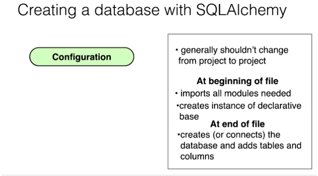

#Lesson 1  Working with the CRUD 




Reference: 

- [Engine Configuration](http://docs.sqlalchemy.org/en/latest/core/engines.html)
- [declarative](http://docs.sqlalchemy.org/en/rel_0_8/orm/extensions/declarative.html)
- [query](http://docs.sqlalchemy.org/en/rel_0_9/orm/query.html)

Note that the `echo = FALSE` parameter was added to the code chunk to prevent printing of the R code that generated the plot.

##CRUD Review

###Operations with SQLAlchemy

in this lesson, we performed all of our CRUD operations with SQLAlchemy on an SQLite database. Before we perform any operations, we must first import the necessary libraries, connect to our restaurantMenu.db, and create a session to interface with the database:

```{}
from sqlalchemy import create_engine
from sqlalchemy.orm import sessionmaker
from database_setup import Base, Restaurant, MenuItem

engine = create_engine('sqlite:///restaurantMenu.db')
Base.metadata.bind=engine
DBSession = sessionmaker(bind = engine)
session = DBSession()
```

###CREATE

We created a new Restaurant and called it Pizza Palace:

```{}
myFirstRestaurant = Restaurant(name = "Pizza Palace")
session.add(myFirstRestaurant)
sesssion.commit()
```

We created a cheese pizza menu item and added it to the Pizza Palace Menu:

```{}
cheesepizza = menuItem(name="Cheese Pizza", description = "Made with all natural ingredients and fresh mozzarella", course="Entree", price="$8.99", restaurant=myFirstRestaurant)
session.add(cheesepizza)
session.commit()
```


###Read

We read out information in our database using the query method in SQLAlchemy:

```{}
firstResult = session.query(Restaurant).first()
firstResult.name

items = session.query(MenuItem).all()
for item in items:
    print item.name
```

###UPDATE

In order to update and existing entry in our database, we must execute the following commands:

1. Find Entry
2. Reset value(s)
3. Add to session
4. Execute session.commit()

We found the veggie burger that belonged to the Urban Burger restaurant by executing the following query:

```{}
veggieBurgers = session.query(MenuItem).filter_by(name= 'Veggie Burger')
for veggieBurger in veggieBurgers:
    print veggieBurger.id
    print veggieBurger.price
    print veggieBurger.restaurant.name
    print "\n"
```


Then we updated the price of the veggie burger to $2.99:

```{}
UrbanVeggieBurger = session.query(MenuItem).filter_by(id=8).one()
UrbanVeggieBurger.price = '$2.99'
session.add(UrbanVeggieBurger)
session.commit() 
```


###Delete

To delete an item from our database we must follow the following steps:

1. Find the entry
2. Session.delete(Entry)
3. Session.commit()

We deleted spinach Ice Cream from our Menu Items database with the following operations:

```{}
spinach = session.query(MenuItem).filter_by(name = 'Spinach Ice Cream').one()
session.delete(spinach)
session.commit() 
```


###

Reference:

[BaseHTTPServer](https://docs.python.org/2/library/basehttpserver.html)
[Python Decorators](http://simeonfranklin.com/blog/2012/jul/1/python-decorators-in-12-steps/)

